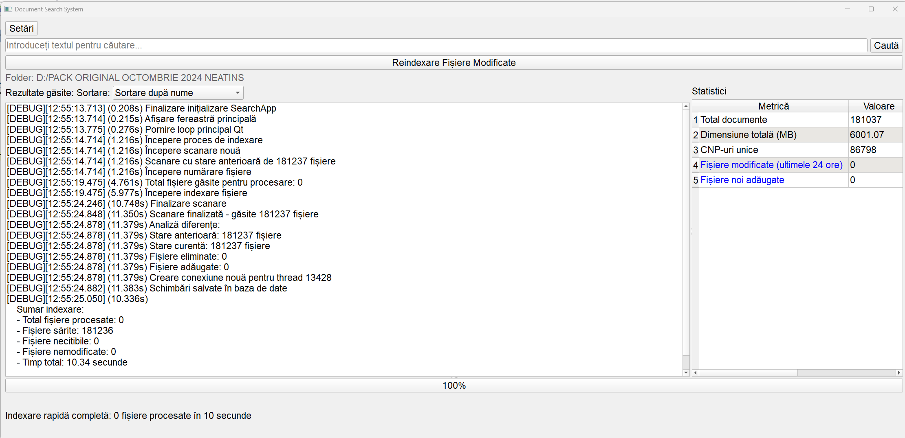

# Document Search System

A powerful document indexing and search application built with Python and PyQt5, optimized for Microsoft Office documents.



## Features

- **Smart Document Indexing**: Efficiently indexes `.doc` and `.docx` files with incremental updates
- **Full-Text Search**: Fast and accurate text search through indexed documents
- **Smart Caching**: Improves search performance with intelligent result caching
- **Document Tracking**: Monitors document changes and identifies frequently modified files
- **CNP Detection**: Special handling for Romanian personal identification numbers (CNP)
- **Configurable Settings**: Customizable indexing modes, refresh intervals, and UI preferences

## Requirements

- Python 3.6+
- PyQt5
- python-docx
- olefile
- PyWin32
- Additional libraries listed in the imports section

## Installation

1. Clone this repository
2. Install required dependencies:

```bash
pip install PyQt5 python-docx olefile pywin32 psutil
```

3. Run the application:

```bash
python search20.py
```

## Usage

### Initial Setup

1. Open the application
2. Click "Setări" (Settings) to access configuration options
3. Select a directory to index by clicking "Director de indexat" (Directory to index)
4. Choose the indexing mode:
   - "Indexare Rapidă" (Quick indexing) - only indexes recently modified files
   - "Indexare de la Începuturi" (Full indexing) - indexes all documents from scratch

### Searching Documents

1. Enter your search query in the text field
2. Click "Caută" (Search) or press Enter
3. Results will appear in the left panel
4. Double-click any result to open the document
5. Right-click for additional options (open file or containing folder)

### Advanced Features

- **Sort Results**: Use the dropdown menu to sort by name, folder, or modification date
- **Modified Files Tracking**: View recently modified files by clicking on the corresponding statistic
- **Statistical Overview**: The right panel displays key metrics about your document collection
- **Font Size Adjustment**: Customize the interface font size in the settings dialog

## Configuration Options

- **Font Size**: Adjust the application text size
- **Indexing Mode**: Choose between adding to existing index or replacing it
- **Cache Usage**: Enable/disable search result caching
- **Modified Files Period**: Set how many hours back to consider files as "recently modified"
- **Partial Index Period**: Set how many days back to consider for partial indexing
- **Startup Reindexing**: Option to automatically reindex on application startup

## Technical Details

The application uses:

- SQLite database for storing document information and search indices
- Multiple extraction methods for different document formats
- Thread-based workers for non-blocking UI during intensive operations
- Automatic recovery from interrupted indexing sessions
- Intelligent document change detection
- Error handling for corrupt or inaccessible files

## Troubleshooting

- **Slow Indexing**: For large document collections, use "Indexare Rapidă" instead of full indexing
- **Unreadable Files**: Some protected or corrupt documents will be marked as unreadable
- **Database Issues**: If you encounter database errors, use "Curăță Index" to reset the database

## License

This project is licensed under the MIT License - see the LICENSE file for details.

## Acknowledgments

- Uses PyQt5 for the user interface
- Implements multiple document parsing strategies for maximum compatibility
- Optimized for Romanian document collections with special handling for diacritics
